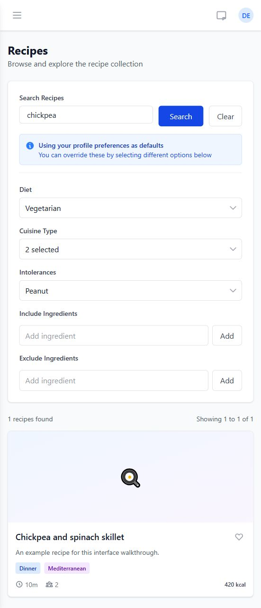
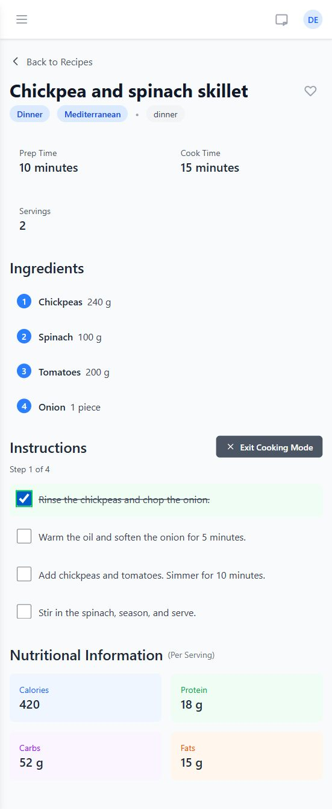
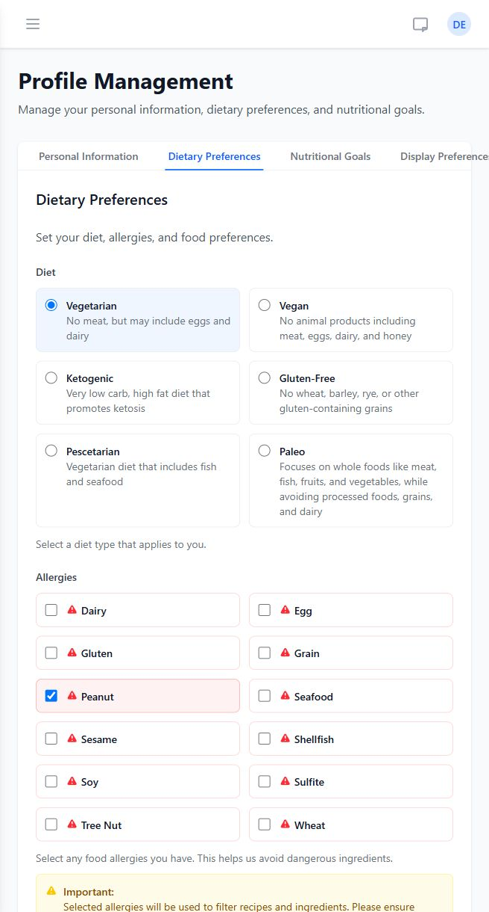
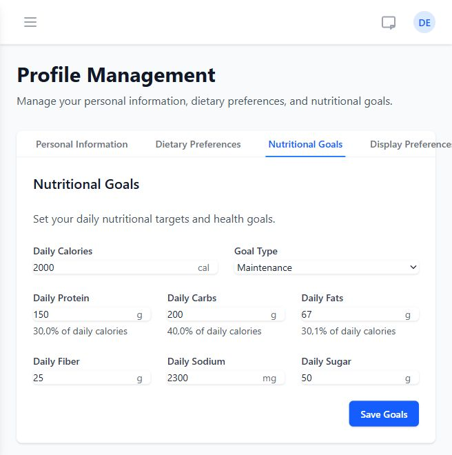
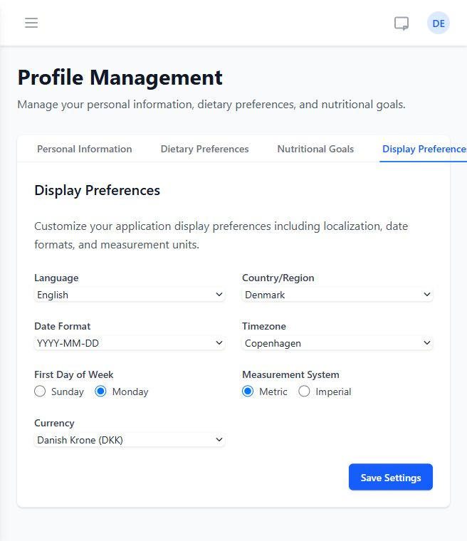
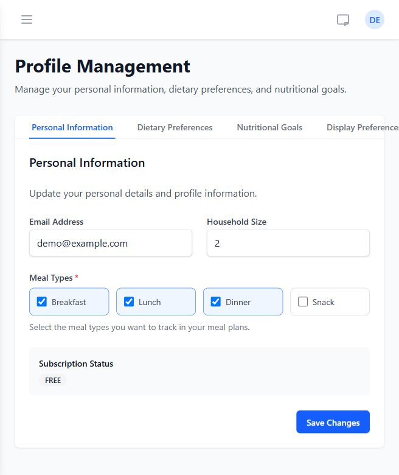

# Vallexia

**Find recipes, cook step by step, and keep your food preferences and nutrition goals in one place.**

Vallexia is a food and nutrition app in development. Its current features cover recipe discovery, favorites, guided cooking, and personal preferences.

The pictures below are screenshots of the existing frontend, rendered with sample API responses for this walkthrough. The recipe, account, and nutrition values are illustrative; they do not show a live account or a verified connection to the recipe provider.

## Find recipes that match your preferences

The search screen combines a recipe name or keyword with diet, cuisine, intolerance, and ingredient filters. You can include ingredients you want to use and exclude ones you want to avoid.

In this picture, **chickpea** is the search term. Vegetarian, two cuisines, and a peanut intolerance are filled from the example user's saved preferences. These defaults can be changed for each search. The result card shows the recipe name, meal category, cuisine, preparation time, servings, and calories. Its heart button adds or removes a favorite.

Recipe search and details use the Spoonacular integration, with caching in the backend. Actual results depend on the configured provider and available recipe data.

## Follow a recipe while cooking

Opening a recipe brings together preparation and cooking times, servings, ingredient quantities, instructions, and nutrition per serving.

The picture shows **Cooking Mode** with the first instruction checked off. Completed steps are highlighted and crossed out, and the progress indicator reads **Step 1 of 4**. Cooking progress is saved in the current browser for that recipe, so you can return to it later. The nutrition cards below the instructions show calories, protein, carbohydrates, and fats when that information is available.

## Save your dietary preferences

The profile lets you choose a diet, record allergies, and select preferred cuisines. Supported diets include vegetarian, vegan, ketogenic, gluten-free, pescetarian, and paleo.

This picture shows **Vegetarian** selected and **Peanut** checked in the allergy list. Preferred cuisines are further down the same form. Saved preferences become defaults in recipe search, reducing the need to select the same filters every time.

## Set personal nutrition targets

The Nutritional Goals tab stores daily targets for calories, protein, carbohydrates, fats, fiber, sodium, and sugar. A goal type such as maintenance or muscle gain can calculate a macro breakdown from the calorie target, and the values can also be edited.

In this example, **Maintenance** is selected with **2,000 daily calories**. The percentages under protein, carbohydrates, and fats show how much of the calorie target each macro represents. This screen configures targets; daily food logging and consumption tracking are not implemented yet.

## Choose how information is displayed

Display preferences control language, country, date format, timezone, the first day of the week, measurement system, and currency. The interface includes English and Danish translations, and supports metric and imperial units.

The picture shows an English interface with **Denmark**, **Copenhagen**, a **Monday** week start, **metric** measurements, and **Danish krone**. These preferences are saved to the user's account and used for formatting and unit display.

## Keep your household profile together

Vallexia includes account registration, sign-in, and sign-out. Once signed in, you can update your email, household size, and preferred meal types.

This example profile has **two household members** and **breakfast, lunch, and dinner** selected. The subscription badge displays the account's current status; it is not a checkout or payment feature.

## Current scope

Recipe search, recipe details, favorites, cooking mode, account management, dietary preferences, nutrition targets, and display settings have implementations in the project.

The dashboard, weekly meal planner, grocery lists, and nutrition overview still contain sample data or placeholder controls. Automatic meal-plan generation, grocery-list generation, and daily nutrition tracking should not yet be treated as completed features.
